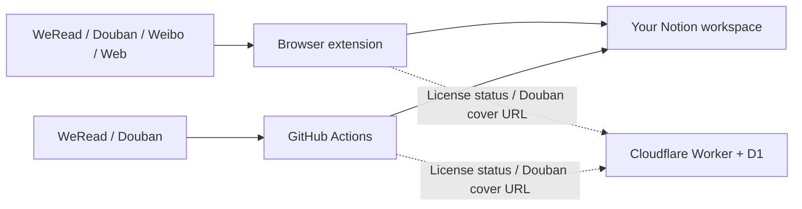

<div align="center">
  
  <h1>TunNest</h1>
  <p><strong>A private nest for everything worth keeping.</strong></p>
  <p>Save WeRead notes, Douban collections, Weibo posts, and clipped web pages to your own Notion workspace.</p>

  <p>
    <a href="https://github.com/zengyincen/TunNest/actions/workflows/ci.yml"></a>
    
    
    
    
    <a href="LICENSE"></a>
  </p>

  <p>
    <a href="#quick-start">Quick start</a> ·
    <a href="#notion-setup">Notion setup</a> ·
    <a href="#cloudflare-license-service">Cloudflare</a> ·
    <a href="#github-actions-daily-sync">Daily sync</a> ·
    <a href="#troubleshooting">Troubleshooting</a> ·
    <strong><ins>English</ins></strong> · 
    <a href="README.zh-CN.md">简体中文</a>
  </p>
</div>


> [!IMPORTANT]
> TunNest is an early-stage, independently maintained project. WeRead, Douban, and Weibo may change their APIs, page structure, signatures, or risk controls without notice. Only archive content you are entitled to access, and follow the terms of each source platform.

## What is TunNest?

TunNest is a Chrome browser extension and a set of optional GitHub Actions that move saved content into databases owned by you. It is not another reading or social platform. Your notes, collections, posts, and clips remain searchable and editable in your own Notion workspace.

| Source | What TunNest saves | Browser extension | GitHub Actions |
|---|---|:---:|:---:|
| WeRead | Books, covers, highlights, and notes | ✅ Browser login or Gateway | ✅ Gateway API key required |
| Douban | User book/movie interests plus Movie, Book, and Music Top 250 | ✅ Signed requests and public-page parsing | ✅ Supported |
| Weibo | User posts, full long-form text, reposts, original images, and engagement counts | ✅ Reuses browser login | — Intentionally excluded |
| Web pages | Metadata, article text, selection, images, video, audio, and source URL | ✅ One-click clipping | — Requires an active page |

<table>
  <tr>
    <td align="center"><strong>4</strong><br><sub>content sources</sub></td>
    <td align="center"><strong>7</strong><br><sub>separate Notion databases</sub></td>
    <td align="center"><strong>7 days</strong><br><sub>full-feature trial</sub></td>
    <td align="center"><strong>3</strong><br><sub>browser device slots</sub></td>
    <td align="center"><strong>1</strong><br><sub>Actions repository slot</sub></td>
    <td align="center"><strong>Daily</strong><br><sub>WeRead and Douban sync</sub></td>
  </tr>
</table>


TunNest is designed for heavy WeRead and Notion users, readers and film lovers, fandom archivists, digital collectors, and anyone who wants saved content to end up somewhere they control.

## Highlights

- Four independent browser workflows: web clipping, WeRead, Douban, and Weibo.
- Seven purpose-built Notion databases with automatic schema creation and migration.
- Full Weibo long-post text and original images, including reposted content.
- Web clipping with article images, video, and audio. Media is imported into Notion when possible.
- Douban user collections and three structured Top 250 databases.
- Optional TMDB poster matching with a 30-day local cache.
- Content fingerprints skip unchanged records and update only when meaningful data changes.
- Persistent sync progress: closing the popup does not hide or restart the job.
- Dynamic Cloudflare license verification; no license public key is embedded in the extension.
- Optional scheduled GitHub Actions for sources that are suitable for unattended GET/POST synchronization.

## Quick start

1. Download the latest extension archive from [GitHub Releases](https://github.com/zengyincen/TunNest/releases/latest).
2. Extract `tunnest-extension.zip`.
3. Open `chrome://extensions` in Chrome or another Chromium browser.
4. Enable **Developer mode**.
5. Click **Load unpacked** and choose the extracted `tunnest-extension` directory.
6. Open TunNest settings, connect Notion, and start the seven-day full trial.

To build the extension yourself:

```bash
git clone https://github.com/zengyincen/TunNest.git
cd TunNest
npm ci
npm test
npm run check
npm run package
```

The build produces:

```text
dist/tunnest-extension/       # Load this directory in Chrome
dist/tunnest-extension.zip    # Upload this file to a GitHub Release
```

> [!TIP]
> After updating the source, open `chrome://extensions` and click **Reload** on TunNest. Close and reopen the popup if an older UI is still visible.

## Notion setup

TunNest uses one Notion Internal Integration token and seven databases:

- one database for clipped web pages;
- one database for WeRead;
- four databases under the Douban parent page: user interests, Movie Top 250, Book Top 250, and Music Top 250;
- one database for Weibo.

The four source groups may live under four different Notion parent pages.

### 1. Create a Notion integration

1. Open [Notion Integrations](https://www.notion.so/my-integrations).
2. Create an **Internal Integration** in the target workspace.
3. Enable read, insert, and update content capabilities.
4. Copy the token beginning with `ntn_…` or `secret_…`.

Treat this token as a password. Never commit it to Git or paste it into an issue.

### 2. Create and share parent pages

Create four empty Notion pages, for example:

- TunNest · Web Clips
- TunNest · WeRead
- TunNest · Douban
- TunNest · Weibo

Use each page's **Connections** menu to share it with the integration created above. An integration cannot create or update databases on a page that has not been shared with it.

### 3. Let TunNest create the databases

1. Open the extension settings.
2. Paste the shared Integration token.
3. Paste a source's parent-page URL.
4. Leave **Existing database ID** empty.
5. Click **Create or connect**.
6. Repeat for Web Clips, WeRead, and Weibo. In the Douban card, create or connect all four databases under the same parent page.

TunNest creates the database and every required property, then stores the returned database ID locally.

### 4. Connect existing databases

Paste the database ID instead of a parent-page URL and click **Create or connect**. TunNest will:

- rename the existing title property to the expected source-specific name;
- create every missing property;
- stop with a precise error if an existing property has the correct name but the wrong type.

> [!WARNING]
> `External ID` must be a regular **Rich text** property, not Notion's **Unique ID** property. TunNest uses it as the deduplication and update key.

`Content Fingerprint` is managed by TunNest. After the first migration sync, unchanged content is skipped. A timestamp change by itself does not cause a rewrite.

### Required database properties

Property names are shown in English below for explanation. The current extension creates the Chinese names listed in the second column; do not translate them manually unless you also change the source code.

#### Web Clips

| Purpose | Required property name | Notion type |
|---|---|---|
| Title | `标题` | Title |
| Cover | `封面` | Files & media |
| Type | `类型` | Select |
| Original page | `原文` | URL |
| Author | `作者` | Rich text |
| Summary | `摘要` | Rich text |
| Tags | `标签` | Multi-select |
| Saved at | `收藏时间` | Date |
| Deduplication key | `外部 ID` | Rich text |
| Change detector | `内容指纹` | Rich text |

Page images, video, and audio are written into the Notion page body, so they do not need additional database properties. TunNest processes up to 24 media items per page: 20 images, four videos, and four audio files. It first asks Notion to import each public HTTPS file. If import fails, it uses an external media block; if that also fails, it leaves a clickable source link. Duplicate media is not imported twice, and failed items are retried when the page is clipped again.

#### WeRead

| Purpose | Required property name | Notion type |
|---|---|---|
| Book title | `书名` | Title |
| Cover | `封面` | Files & media |
| Author | `作者` | Rich text |
| Source book | `原书链接` | URL |
| Highlight count | `划线数量` | Number |
| Sync summary | `同步摘要` | Rich text |
| Tags | `标签` | Multi-select |
| Synced at | `同步时间` | Date |
| Deduplication key | `外部 ID` | Rich text |
| Change detector | `内容指纹` | Rich text |

The book image is written to both the `封面` property and the Notion page cover.

#### Douban user interests

| Purpose | Required property name | Notion type |
|---|---|---|
| Name | `名称` | Title |
| Cover | `封面` | Files & media |
| Original cover URL | `封面原图` | URL |
| Media type | `类型` | Select |
| Source item | `原条目` | URL |
| Creator | `主创` | Rich text |
| Interest status | `状态` | Select |
| Rating | `评分` | Number |
| Comment | `短评` | Rich text |
| Tags | `标签` | Multi-select |
| Saved at | `收藏时间` | Date |
| Deduplication key | `外部 ID` | Rich text |
| Change detector | `内容指纹` | Rich text |

#### Douban Top 250 databases

All three Top 250 databases use `名称` as Title and include `封面`, `封面原图`, `排名`, `评分`, `评价人数`, `推荐语`, `原条目`, `标签`, `抓取时间`, `外部 ID`, and `内容指纹`.

They also contain source-specific fields:

| Database | Additional properties |
|---|---|
| Movie Top 250 | `导演`, `主演`, `年份`, `国家/地区`, `类型` |
| Book Top 250 | `作者`, `译者`, `出版社`, `出版日期`, `定价` |
| Music Top 250 | `艺术家`, `发行日期`, `版本类型`, `介质`, `流派` |

#### Weibo

| Purpose | Required property name | Notion type |
|---|---|---|
| Post title | `博文` | Title |
| First uploaded image | `封面` | Files & media |
| User | `用户` | Rich text |
| Original post | `原博文` | URL |
| Text summary | `正文摘要` | Rich text |
| Reposts | `转发数` | Number |
| Comments | `评论数` | Number |
| Likes | `点赞数` | Number |
| Tags | `标签` | Multi-select |
| Published at | `发布时间` | Date |
| Deduplication key | `外部 ID` | Rich text |
| Change detector | `内容指纹` | Rich text |

Weibo images are downloaded by the extension and uploaded to your Notion file space. The first successful image also becomes the Files property cover. Keep the browser running until the upload finishes.

## Source configuration

### Web clipping

1. Connect the Web Clips database.
2. Open the page you want to archive.
3. Click **Clip current page** in the extension popup.
4. You may also select text and choose **Save to TunNest** from the context menu.
5. The default shortcut is `Alt+Shift+S`; on macOS it is `Control+Shift+S`.

TunNest saves article text, the current selection, metadata, and supported media. It filters obvious icons, avatars, tracking pixels, and duplicates. Interactive applications, paywalls, cross-origin iframes, `blob:`/`data:` URLs, or login-only media may not be fully importable; the source link is retained when possible.

### WeRead

Browser sync does not require an API key:

1. Open [WeRead Web](https://weread.qq.com/) and sign in.
2. Keep at least one `weread.qq.com` tab open.
3. Leave the optional Gateway API key empty.
4. Click **Sync WeRead**.

If you provide a Gateway API key, TunNest uses it instead of the open browser tab. GitHub Actions cannot reuse a browser login, so `WEREAD_API_KEY` is required for unattended WeRead sync.

### Douban

1. Open your Douban profile, for example `https://www.douban.com/people/example/`.
2. Copy the value after `/people/`, or paste the full profile URL into TunNest.
3. Under one Douban parent page, create or connect the user, Movie Top 250, Book Top 250, and Music Top 250 databases.
4. Click **Sync Douban**.

Public interests usually do not require an Auth token. Private interests may require one. TunNest automatically signs the current Frodo-compatible request; the obsolete `DOUBAN_API_KEY` setting is no longer required.

The three public lists are read from:

- `https://movie.douban.com/top250`
- `https://book.douban.com/top250`
- `https://music.douban.com/top250`

The first full sync creates roughly 750 structured records and can take several minutes because of Notion rate limits.

#### Cover providers

The default `mirror-first` mode performs one health check, then builds cached image URLs in this format:

```text
https://dbimg.imnotfound.eu.org/<movie|book|music>/<douban-subject-id>.jpg
```

If the mirror is unavailable, TunNest falls back to the configured Cloudflare Douban image proxy. Original URLs remain in `封面原图`.

#### Optional TMDB movie posters

TMDB is used only for movies. Available modes are:

- `douban`: do not use TMDB;
- `tmdb-first`: use an exact TMDB title-and-year match first, with Douban as fallback;
- `tmdb-fallback`: keep Douban when available and use TMDB only as fallback.

Create a TMDB API Read Access Token, paste it into the extension settings, and select a TMDB mode. The token stays in local extension storage and matches are cached for 30 days.

This product uses the TMDB API but is not endorsed or certified by TMDB. Review the current TMDB attribution and commercial-use terms before distributing a paid product.

### Weibo

1. Sign in to `weibo.com` in the browser.
2. Enter one or more numeric user UIDs in TunNest settings, separated by commas.
3. Select the number of pages to read, from 1 to 10.
4. Click **Sync Weibo**.

TunNest first reuses an open desktop Weibo tab and can fall back to an open mobile Weibo tab. It expands long posts, preserves reposted text, and requests original-resolution images. Cookies remain inside the Weibo page and are never exported to TunNest, Cloudflare, or GitHub Actions.

Status `432`, a verification challenge, “no content,” or “login required” means Weibo has risk-controlled the request. Complete verification in the browser, wait, and retry at a lower frequency.

## Subscription and licensing

New installations receive a continuous seven-day full-feature trial after the first online validation. Trial expiry prevents new synchronization; it never deletes or locks content already written to Notion.

All paid plans include the same features, future maintenance releases, priority support, three browser device slots, and one GitHub Actions repository slot.

| Plan | Price | Duration |
|---|---:|---:|
| Monthly | ¥9.9 | 31 days |
| Half-year | ¥19.9 | 183 days |
| Yearly | ¥39.9 | 366 days |
| Lifetime | ¥299 | No expiry |

GitHub Actions is an unattended service and does not participate in the trial. It requires an active paid license.

To activate, paste a `tunnest_…` license key into the extension settings and click **Activate online**. If all browser slots are occupied, release the current installation from an old device before activating a new one.

### Administrator license management

The `Issue subscription license` workflow creates customer licenses without exposing the key in logs. Required GitHub values:

- Repository Variable `LICENSE_API_BASE`
- Repository Secret `LICENSE_ADMIN_TOKEN`

The administrator can suspend, restore, extend, clear device bindings, or revoke a license:

```bash
# Suspend
curl -X PATCH "$LICENSE_API_BASE/v1/admin/licenses/lic_xxx" \
  -H "Authorization: Bearer $LICENSE_ADMIN_TOKEN" \
  -H "Content-Type: application/json" \
  -d '{"status":"suspended"}'

# Restore
curl -X PATCH "$LICENSE_API_BASE/v1/admin/licenses/lic_xxx" \
  -H "Authorization: Bearer $LICENSE_ADMIN_TOKEN" \
  -H "Content-Type: application/json" \
  -d '{"status":"active"}'

# Extend by 30 days
curl -X PATCH "$LICENSE_API_BASE/v1/admin/licenses/lic_xxx" \
  -H "Authorization: Bearer $LICENSE_ADMIN_TOKEN" \
  -H "Content-Type: application/json" \
  -d '{"extendDays":30}'

# Clear browser and Actions bindings
curl -X PATCH "$LICENSE_API_BASE/v1/admin/licenses/lic_xxx" \
  -H "Authorization: Bearer $LICENSE_ADMIN_TOKEN" \
  -H "Content-Type: application/json" \
  -d '{"clearDevices":true}'

# Permanently revoke
curl -X PATCH "$LICENSE_API_BASE/v1/admin/licenses/lic_xxx" \
  -H "Authorization: Bearer $LICENSE_ADMIN_TOKEN" \
  -H "Content-Type: application/json" \
  -d '{"status":"revoked"}'
```

## Cloudflare license service

Cloudflare is used only for dynamic license verification and the Douban image fallback proxy. D1 stores small license records and anonymous installation hashes; it does not store clipped content, platform cookies, Notion tokens, or image files.

### 1. Create D1 and deploy the Worker

```bash
cd license-worker
npm install
npx wrangler login
npx wrangler d1 create tunnest-license
```

Copy the returned D1 `database_id` into `license-worker/wrangler.toml`, then run:

```bash
npm run db:remote
npx wrangler secret put ADMIN_TOKEN
npm run deploy
```

Use a random administrator token of at least 32 bytes. One option is:

```bash
openssl rand -hex 32
```

Do not store `ADMIN_TOKEN` in source code. Put the same value in GitHub Secret `LICENSE_ADMIN_TOKEN` only if you use the license-issuance workflow.

### 2. Verify the deployment

The Worker root intentionally returns an “endpoint not found” response. Test the health endpoint instead:

```text
https://your-license-domain.example/v1/health
```

A successful deployment returns JSON containing `"ok": true`.

### 3. Configure a custom domain and DNS

If the domain is already managed by Cloudflare:

1. Open **Workers & Pages** in the Cloudflare dashboard.
2. Select the TunNest license Worker.
3. Open **Settings → Domains & Routes**.
4. Choose **Add → Custom Domain**.
5. Enter a dedicated hostname such as `license.example.com`.
6. Confirm the automatically created proxied DNS record.

After the certificate becomes active, update all three locations:

- `extension/config.js` → `licenseApiBase`
- `product.config.json` → `licenseApiBase`
- GitHub Repository Variable `LICENSE_API_BASE`

Do not include a trailing slash in `LICENSE_API_BASE`.

### 4. Free-tier expectations

The free Workers and D1 quotas are generally enough for an early personal deployment because each validation stores only small rows. Douban images are streamed and cached at the Cloudflare edge; they are not written to D1, R2, or another object store. Monitor actual Workers requests, cache hit rate, and D1 usage as the user base grows, because Cloudflare may change its quotas.

More implementation detail is available in [the license-service deployment guide](docs/license-service.md).

## GitHub Actions daily sync

The scheduled workflow includes only WeRead and Douban, the two sources that are suitable for unattended GET/POST access. Weibo and arbitrary web pages are intentionally excluded.

### 1. Prepare database IDs

Connect the WeRead and all four Douban databases in the extension first. Copy each 32-character database ID from TunNest settings or its Notion URL.

### 2. Add Repository Variables

Go to **Settings → Secrets and variables → Actions → Variables**.

| Variable | Required | Value |
|---|:---:|---|
| `LICENSE_API_BASE` | ✅ | Deployed Worker URL, without a trailing slash |
| `DOUBAN_IMAGE_PROVIDER` | Optional | `mirror-first` or `cloudflare`; default is `mirror-first` |
| `MOVIE_COVER_PROVIDER` | Optional | `douban`, `tmdb-first`, or `tmdb-fallback` |

### 3. Add Repository Secrets

Go to **Settings → Secrets and variables → Actions → Secrets**.

| Secret | Used by | Description |
|---|---|---|
| `TUNNEST_LICENSE_KEY` | Both | Active paid TunNest license |
| `NOTION_TOKEN` | Both | Shared Notion Integration token |
| `NOTION_WEREAD_DATABASE_ID` | WeRead | WeRead database ID |
| `WEREAD_API_KEY` | WeRead | WeRead Gateway API key |
| `NOTION_DOUBAN_DATABASE_ID` | Douban | User-interest database ID |
| `NOTION_DOUBAN_MOVIE_TOP250_DATABASE_ID` | Douban | Movie Top 250 database ID |
| `NOTION_DOUBAN_BOOK_TOP250_DATABASE_ID` | Douban | Book Top 250 database ID |
| `NOTION_DOUBAN_MUSIC_TOP250_DATABASE_ID` | Douban | Music Top 250 database ID |
| `DOUBAN_USER_ID` | Douban | Value after `/people/` in the profile URL |
| `DOUBAN_AUTH_TOKEN` | Douban, optional | Needed only for non-public interests |
| `TMDB_ACCESS_TOKEN` | TMDB modes | TMDB API Read Access Token |
| `LICENSE_ADMIN_TOKEN` | License issuance only | Not read by the daily sync workflow |

The legacy `NOTION_DATABASE_ID` is only a compatibility fallback and should not be used in a new setup. `DOUBAN_API_KEY` is obsolete and can be removed.

### 4. Test the workflow manually

1. Open the repository's **Actions** tab.
2. Select **TunNest daily content sync**.
3. Click **Run workflow**.
4. Choose `weread`, `douban`, or `all`.
5. Review the two independent job logs.

A WeRead failure does not stop Douban, and a Douban failure does not stop WeRead. License validation happens before platform data is read or Notion is modified.

### 5. Change the daily schedule

The default schedule is:

```yaml
schedule:
  - cron: "23 18 * * *"
```

GitHub cron uses UTC. `18:23 UTC` is approximately `02:23` the next day in China Standard Time. To run around 09:00 China Standard Time, use:

```yaml
schedule:
  - cron: "0 1 * * *"
```

Edit `.github/workflows/daily-sync.yml` and commit the change to the default branch.

Each paid license includes one Actions repository slot identified by `owner/repository`. Moving the license to a different repository requires the administrator to clear old bindings or issue another license.

See [the focused GitHub Actions guide](docs/github-actions.md) for a compact checklist.

## Publishing a release

Source workflows must be committed under `.github/workflows/*.yml` on the default branch. Uploading only a ZIP to a Release does not install workflows into the repository.

```bash
git add .
git commit -m "release: TunNest v1.4.4"
git push origin main

npm ci
npm test
npm run check
npm run package

gh release create v1.4.4 dist/tunnest-extension.zip \
  --title "TunNest v1.4.4" \
  --notes "TunNest v1.4.4"
```

Keep both the source repository and the Release archive: the repository provides reviewable code, issues, and Actions; the archive is convenient for browser installation. Secrets and Notion tokens are never included in the ZIP.

## Troubleshooting

<details>
<summary><strong>The license domain returns “endpoint not found”</strong></summary>

This is expected at `/`. Open `/v1/health`; `{"ok":true,...}` confirms that the Worker is running.
</details>

<details>
<summary><strong>The license workflow reports a missing LICENSE_ADMIN_TOKEN</strong></summary>

Create a Repository **Secret** named exactly `LICENSE_ADMIN_TOKEN`. Do not create it as a Variable, wrap the value in quotes, or paste a Markdown-formatted link.
</details>

<details>
<summary><strong>The Worker reports “administrator authentication failed”</strong></summary>

GitHub Secret `LICENSE_ADMIN_TOKEN` and Worker Secret `ADMIN_TOKEN` do not match. Run `npx wrangler secret put ADMIN_TOKEN` again and save the same raw value in GitHub.
</details>

<details>
<summary><strong>Chrome reports “Manifest is not valid JSON”</strong></summary>

Run `npm run check` from the repository root, fix the reported JSON syntax, and rebuild with `npm run package`. Do not edit files inside the ZIP directly.
</details>

<details>
<summary><strong>Notion cannot find the `外部 ID` property</strong></summary>

Open TunNest settings and reconnect the corresponding database. The current extension creates missing properties automatically. If a property with that name already exists with the wrong type, rename or remove it first. The required type is Rich text, not Unique ID.
</details>

<details>
<summary><strong>Notion returns `body failed validation`</strong></summary>

Confirm that the database is connected to the correct source and that same-name properties use the types listed above. Reconnect to migrate the schema, then confirm that the integration can read, insert, and update content.
</details>

<details>
<summary><strong>Douban returns `invalid_request_997`</strong></summary>

Upgrade to the latest version and reload the extension. Current releases generate the required request signature automatically; do not configure the obsolete `DOUBAN_API_KEY`.
</details>

<details>
<summary><strong>Weibo returns 432, empty content, or login required</strong></summary>

Open the target profile on `weibo.com`, complete any verification, and confirm that posts are visible. Wait before retrying and avoid frequent repeated syncs. Cloudflare and GitHub Actions cannot bypass Weibo risk controls.
</details>

<details>
<summary><strong>Weibo images appear only as links or fail to upload</strong></summary>

Keep the browser open until download, upload, and block creation are complete. Confirm that the Notion integration can update content. An expired source URL, interrupted network, or a file over Notion's limit causes TunNest to retain a clickable original link.
</details>

<details>
<summary><strong>The sync button needs a second click or progress disappears</strong></summary>

Upgrade and reload the extension. Current versions bind actions before initialization and store sync progress in extension local storage. Reopening the popup restores the running state. Do not close the entire browser during a long job.
</details>

<details>
<summary><strong>No workflow appears in the repository</strong></summary>

Confirm that `.github/workflows/ci.yml`, `daily-sync.yml`, and `issue-license.yml` are committed to the default branch and Actions are enabled under repository settings. A Release ZIP alone does not add source workflows.
</details>

## Privacy and security boundaries



- Content goes directly from the extension or Actions to the user's Notion workspace.
- The Cloudflare Worker does not receive clipped text, platform cookies, or Notion tokens.
- Notion tokens live only in `chrome.storage.local` or GitHub Secrets.
- D1 stores license hashes, anonymous installation hashes, plan state, expiry, and device slots.
- Douban images are streamed and edge-cached; they are not stored in D1, R2, or another persistent object store.
- No license public key or permanent offline entitlement is embedded in the extension.
- Entitlement refreshes online every six hours, with a limited offline grace period.
- Weibo cookies remain in Weibo's own browser context.
- The bundled Noto Sans SC subset is used under the SIL Open Font License; see `brand/fonts/`.

See [Architecture](docs/architecture.md) and [Security Policy](SECURITY.md) for additional detail.

## Project structure and development

```text
TunNest/
├── extension/          # Chrome Manifest V3 extension
├── automation/         # WeRead and Douban → Notion scripts
├── license-worker/     # Cloudflare Worker + D1 licensing
├── .github/workflows/  # CI, daily sync, and license issuance
├── brand/              # Icons, banners, diagrams, and font license
├── docs/               # Architecture, policy, and setup notes
├── test/               # Configuration, source, Notion, and license tests
└── tools/              # Administrator license utility
```

```bash
npm test          # Run the test suite
npm run check     # Validate JSON, YAML, JavaScript, and extension assets
npm run package   # Build the unpacked extension and ZIP
npm run sync      # Run an environment-configured sync locally

cd license-worker
npm run check     # Type-check the Worker
npm run db:remote # Apply remote D1 migrations
npm run deploy    # Deploy the Worker
```

## Current limitations

- Douban user interests use an unofficial Frodo-compatible interface, while the Top 250 lists are parsed from public pages. Either path may change.
- Weibo supports active browser sync only; it is not included in Actions.
- Web clipping quality depends on page structure, login state, embedded frames, and paywalls.
- WeRead Actions require a Gateway API key; browser login cannot replace it in GitHub runners.
- The extension has not completed official Chrome Web Store review.
- Publishers must connect payment completion to license delivery themselves; the repository currently includes a manual Actions-based issuance flow.
- Saving content to Notion does not change its copyright or the user's obligations to source platforms and authors.

## Inspiration and ecosystem references

TunNest's initial research reviewed the product boundaries and synchronization patterns of:

- [malinkang/weread2notion](https://github.com/malinkang/weread2notion)
- [malinkang/weread2notion-pro](https://github.com/malinkang/weread2notion-pro)
- [malinkang/douban2notion](https://github.com/malinkang/douban2notion)
- [malinkang/duolingo2notion](https://github.com/malinkang/duolingo2notion)
- [malinkang/keep2notion](https://github.com/malinkang/keep2notion)
- [malinkang/notionhub-integration](https://github.com/malinkang/notionhub-integration)

Reference does not imply affiliation, partnership, or endorsement. Respect each upstream project's license and attribution requirements.

## Contributing and license

Bug reports, compatibility fixes, documentation improvements, and reproducible tests are welcome. Read [CONTRIBUTING.md](CONTRIBUTING.md) before opening a pull request. Never publish cookies, API tokens, Notion tokens, or license keys in an issue.

TunNest source code is available under the [MIT License](LICENSE). Platform content, third-party APIs, trademarks, and user data keep their original ownership and terms.

---

<div align="center">
  
  <p><strong>Saving is not hoarding. It is giving something you love a place where you can find it again.</strong></p>
  <p><a href="https://github.com/zengyincen/TunNest/releases/latest">Download the latest release</a> · <a href="#quick-start">Build your private archive</a></p>
</div>
