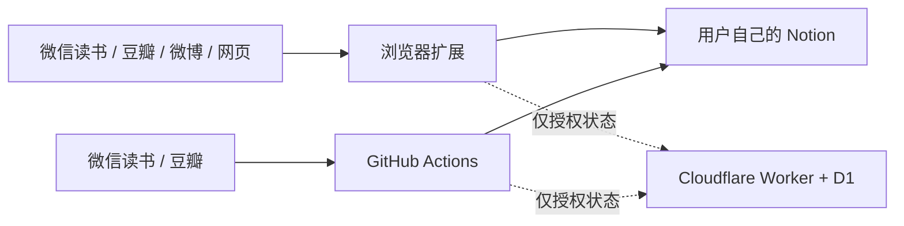

<div align="center">
  
  <h1>囤囤 TunNest</h1>
  <p><strong>把散落的喜欢，收进自己的数字巢穴。</strong></p>
  <p>微信读书、豆瓣、微博与网页剪藏，一站同步到你自己的 Notion。</p>

  <p>
    <a href="../../actions/workflows/ci.yml"></a>
    
    
    
    
    <a href="LICENSE"></a>
  </p>

  <p>
    <a href="#-三分钟开始收藏">三分钟上手</a> ·
    <a href="#-它能替你囤下什么">功能</a> ·
    <a href="#-订阅方案">订阅</a> ·
    <a href="docs/setup.md">完整配置</a> ·
    <a href="docs/architecture.md">隐私与架构</a>
  </p>
</div>


> [!IMPORTANT]
> 囤囤仍处于早期版本。微信读书、豆瓣和微博的接口、页面结构与风控策略可能随时变化；请只同步你有权访问和保存的内容，并遵守对应平台条款。

## 为什么是囤囤？

喜欢一本书时划了线，看完电影后写了短评，刷到爱豆的一条博文舍不得它沉进时间线，偶遇一篇好文章却只剩下“稍后阅读”——我们的喜欢散落在太多应用里。

**囤囤不是另一个内容平台，而是一条通往你私人资料库的路。** 它把不同来源分别整理进四个专属 Notion 数据库。搜索、标签、回顾和长期保存，都重新回到你手里。

它尤其适合这些人：

| 你可能是 | 囤囤替你解决什么 |
|---|---|
| 微信读书重度用户 | 把书籍、划线和笔记沉淀为可检索的阅读档案 |
| 追星与内容收藏用户 | 将有权访问的公开博文保存到自己的 Notion，减少时间线失联焦虑 |
| 文艺青年、书影音爱好者 | 把豆瓣评分、状态与短评连成个人文化年表 |
| Notion 重度用户 | 少复制粘贴，多留下结构化、可二次整理的数据 |
| 网页仓鼠派 | 一键收藏全文或选区，给“以后会看”一个真正找得到的家 |
| 喜欢尝鲜的人 | 用一个克制、轻量的扩展搭建自己的数字收藏工作流 |

## ✦ 它能替你囤下什么

| 来源 | 保存内容 | 浏览器扩展 | 每日 GitHub Actions |
|---|---|:---:|:---:|
| 微信读书 | 书籍、阅读状态、划线、笔记 | ✅ | ✅ Gateway API Key |
| 豆瓣 | 书 / 影 / 音状态、评分、短评 | ✅ 实验性 | ✅ Frodo 内部接口（实验性） |
| 微博 | 指定用户博文，适合建立公开内容收藏档案 | ✅ 浏览器登录态 | — 风控较高，不自动抓取 |
| 任意网页 | 标题、链接、正文与选区 | ✅ 一键剪藏 | — 无稳定自动来源 |

微博内容一旦成功写入你的 Notion，就不再依赖信息流排序；但源内容版权仍属于原作者，源站删除、账号权限变化或平台风控都可能影响后续同步。

> 豆瓣过去的官方开放 API 已停止面向新项目申请。当前 Frodo 适配不是官方开放 API，可能随时因 Key、签名或风控策略变化而失效。

### 一眼看懂

<table>
  <tr>
    <td align="center"><strong>4</strong><br><sub>类收藏来源</sub></td>
    <td align="center"><strong>7 天</strong><br><sub>新用户完整试用</sub></td>
    <td align="center"><strong>3 台</strong><br><sub>付费浏览器设备</sub></td>
    <td align="center"><strong>1 个</strong><br><sub>Actions 仓库槽位</sub></td>
    <td align="center"><strong>24 小时</strong><br><sub>临时断网宽限</sub></td>
    <td align="center"><strong>每天 1 次</strong><br><sub>微信读书 / 豆瓣自动同步</sub></td>
  </tr>
</table>


## ✦ 不只是“搬运”

- **一个入口收好四处的喜欢**：读书、观影、追星、冲浪，不再各自孤立。
- **写进你自己的数据库**：四个来源可以放在四个不同 Notion 页面，继续加标签、关联项目或做年度回顾。
- **自动同步能自动的部分**：GitHub Actions 每天处理适合稳定 GET / POST 的微信读书和豆瓣来源。
- **谨慎处理高风控来源**：微博只在浏览器登录态下由用户主动同步，不把账号 Cookie 上传到 Actions。
- **重复运行也安心**：同步流程按来源 ID / URL 识别内容，减少重复页面。
- **苹果式轻量界面**：低干扰、少按钮、清晰状态，让收藏动作尽量短。

## ✦ 三分钟开始收藏

### 普通用户：安装扩展

1. 从 [Releases](../../releases) 下载最新的 `TunNest-extension-*.zip` 并解压。
2. 打开 Chrome 的 `chrome://extensions`，开启右上角「开发者模式」。
3. 点击「加载已解压的扩展程序」，选择解压后的 `tunnest-extension` 文件夹。
4. 打开扩展设置，连接 Notion，然后开始 **7 天完整试用**。

> 正式发布到 Chrome Web Store 后，可将这一段替换为商店一键安装链接。

### 项目维护者：部署自己的版本

```bash
git clone https://github.com/YOUR_GITHUB_USERNAME/TunNest.git
cd TunNest
npm install
npm test
npm run package
```

接着完成三项配置：

1. 按 [许可证服务部署文档](docs/license-service.md) 创建 Cloudflare Worker 与 D1。
2. 替换 `extension/config.js`、`product.config.json` 中的 Worker 地址、购买链接与客服邮箱。
3. 在 Chrome 加载 `extension/`；需要每日同步时再配置 [GitHub Actions Secrets](docs/github-actions.md)。

## ✦ Notion 里会得到什么

囤囤共用一个 Notion Integration Token，但分别连接四个数据库：

| 数据库 | 专属字段示例 |
|---|---|
| 囤囤 · 网页剪藏 | 标题、类型、原文、作者、摘要、收藏时间 |
| 囤囤 · 微信读书 | 书名、作者、原书链接、划线数量、同步时间 |
| 囤囤 · 豆瓣书影音 | 名称、类型、状态、评分、短评、收藏时间 |
| 囤囤 · 微博博文 | 博文、用户、正文摘要、转发数、评论数、点赞数、发布时间 |

四个数据库可以放在不同父页面。留空数据库 ID 时扩展会自动创建完整字段；连接已有数据库时，属性名称与类型必须匹配。完整清单见 [安装与 Notion 配置](docs/setup.md)。

## ✦ 订阅方案

新用户无需绑卡，首次在线验证后自动获得 **连续 7 天完整功能**。试用期不限制来源和同步数量；到期后只暂停新的同步，已经写入 Notion 的内容不会删除、加水印或锁定。

| 套餐 | 价格 | 适合谁 |
|---|---:|---|
| 月度 | **¥9.9 / 月** | 先用一个月，确认它能融入日常 |
| 半年 | **¥19.9 / 半年** | 稳定使用，但暂时不想长期承诺 |
| 年度 · 推荐 | **¥39.9 / 年** | 阅读、观影与收藏已经成为习惯 |
| 永久买断 | **¥299** | 想长期拥有，并获得后续维护更新 |

所有付费方案功能一致，均包含：

- 全部四类同步能力；
- 3 台浏览器设备；
- 1 个独立 GitHub Actions 仓库槽位；
- 后续维护更新；
- 优先客服支持。

设备额度不是硬件锁。用户可以在设置中主动释放本机授权，正常换机可联系支持重置。完整规则见 [订阅限制原则](docs/subscription-policy.md)。

## ✦ GitHub Actions：每天醒来，资料库已经更新

每日工作流只同步适合稳定请求的平台内容：

```text
付费许可证验证
        ↓ 通过
读取微信读书 / 豆瓣
        ↓
清洗与去重
        ↓
写入你的 Notion 数据库
```

许可证验证发生在读取平台数据之前。验证失败时，Action 会立即结束，不抓取微信读书或豆瓣，也不调用 Notion。微博因登录态和风控风险刻意排除在 Actions 之外。

所需变量与 Secrets 见 [GitHub Actions 配置](docs/github-actions.md)。

## ✦ 隐私：你的收藏，不绕路

囤囤采用「内容直达 Notion，Cloudflare 只管授权」的边界：

- 微信读书、豆瓣、微博和网页内容由扩展或 Actions 直接发送至 Notion；
- Cloudflare Worker **不接收**收藏内容、平台 Cookie 或 Notion Token；
- Notion Token 只保存在本机 `chrome.storage.local` 或 GitHub Secrets；
- 扩展随机生成匿名安装 ID，不读取硬盘序列号、MAC 地址或 Chrome 账号；
- D1 只保存许可证哈希、匿名安装码哈希、套餐和到期状态；
- 扩展每 6 小时动态验证一次，网络异常时最多宽限 24 小时；宽限不会延长已到期试用。



更详细的数据边界、威胁模型与接口关系见 [架构说明](docs/architecture.md)。

## ✦ 项目结构

```text
TunNest/
├── extension/          # Chrome Manifest V3 浏览器扩展
├── automation/         # 微信读书、豆瓣 → Notion 同步脚本
├── license-worker/     # Cloudflare Worker + D1 动态授权
├── .github/workflows/  # CI、每日同步和许可证签发
├── brand/              # 图标、README 视觉资产和字体许可
├── docs/               # 部署、架构、订阅与验证文档
├── test/               # 配置、转换与订阅行为测试
└── tools/              # 管理员许可证工具
```

### 常用命令

```bash
npm test          # 运行 Node 测试
npm run check     # 检查项目配置和扩展资源
npm run package   # 生成可发布扩展 ZIP
npm run sync      # 本地运行自动同步
```

## ✦ 当前能力边界

为了不把“能演示”写成“永远稳定”，这些限制需要提前说明：

- 上游非公开接口可能变更，真实账号首次使用前应按 [验证记录](docs/verification.md) 测试；
- 微博可能出现频率限制、验证码或 HTTP 432，只支持浏览器主动同步；
- 网页剪藏效果取决于页面结构，强交互、付费墙或登录后页面可能无法完整提取；
- GitHub Actions 需要用户自行提供 Notion 与来源平台 Secrets；
- 当前扩展尚未完成 Chrome Web Store 正式审核；
- 示例 Worker、购买链接与客服邮箱必须在发布前替换。

## ✦ 常见问题

<details>
<summary><strong>试用结束后，我之前同步的东西会消失吗？</strong></summary>

不会。到期后只暂停新的同步，已经进入你 Notion 的页面始终由你掌控。
</details>

<details>
<summary><strong>为什么不直接读取“设备唯一编码”？</strong></summary>

Chrome 不会向扩展安全地开放稳定硬件 ID。囤囤使用随机生成的匿名安装 ID，并只在服务端保存 SHA-256 哈希，既能管理设备额度，也避免采集硬件指纹。
</details>

<details>
<summary><strong>能保证爱豆博文永久存在吗？</strong></summary>

成功写入 Notion 后，该副本由你自己的工作区保存，不再依赖微博时间线。但囤囤不能保证源站接口永远可用，也不应绕过权限保存非公开内容；请尊重原作者版权和平台规则。
</details>

<details>
<summary><strong>Cloudflare 免费额度够用吗？</strong></summary>

对早期个人项目通常足够。Worker 只处理轻量授权请求，扩展还有 6 小时本地验证缓存；实际容量仍取决于活跃设备数和 Cloudflare 当期免费套餐政策。
</details>

<details>
<summary><strong>为什么 GitHub Actions 没有 7 天试用？</strong></summary>

Actions 是持续、无人值守的自动服务，因此只向付费许可证开放，并单独占用 1 个仓库槽位。浏览器中的完整试用不受影响。
</details>

## ✦ 灵感与生态参考

囤囤在研究阶段参考了以下开源项目的产品边界与同步思路：

- [malinkang/weread2notion](https://github.com/malinkang/weread2notion)
- [malinkang/weread2notion-pro](https://github.com/malinkang/weread2notion-pro)
- [malinkang/douban2notion](https://github.com/malinkang/douban2notion)
- [malinkang/duolingo2notion](https://github.com/malinkang/duolingo2notion)
- [malinkang/keep2notion](https://github.com/malinkang/keep2notion)
- [malinkang/notionhub-integration](https://github.com/malinkang/notionhub-integration)

参考不代表从属、合作或官方授权。请尊重每个项目各自的许可证和署名要求。

## ✦ 参与贡献

欢迎提交 Bug、接口兼容修复、文档改进和可复现测试。开始前请阅读 [CONTRIBUTING.md](CONTRIBUTING.md) 与 [SECURITY.md](SECURITY.md)。涉及上游平台时，请勿在 Issue 中公开 Cookie、Token 或其他私密凭据。

## License

项目代码采用 [MIT License](LICENSE)。平台内容、第三方接口、品牌名称与用户保存的数据不因本项目许可证而改变其权利归属。

---

<div align="center">
  
  <p><strong>收藏不是囤积，是给喜欢的东西一个以后还能找到的位置。</strong></p>
  <p><a href="../../releases">下载最新版本</a> · <a href="docs/setup.md">开始搭建我的数字巢穴</a></p>
</div>
