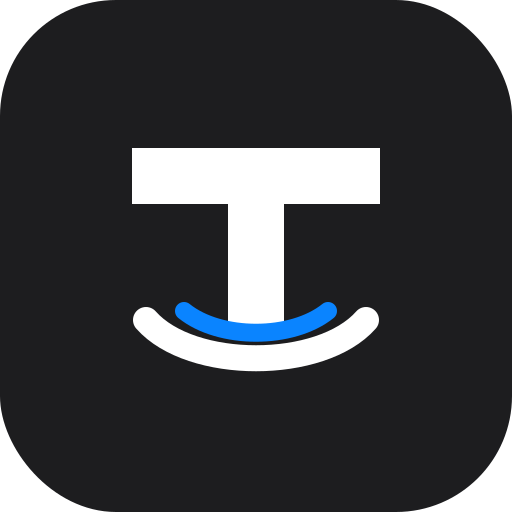
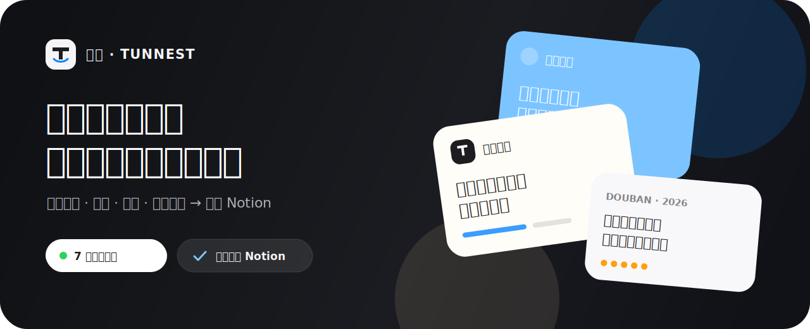
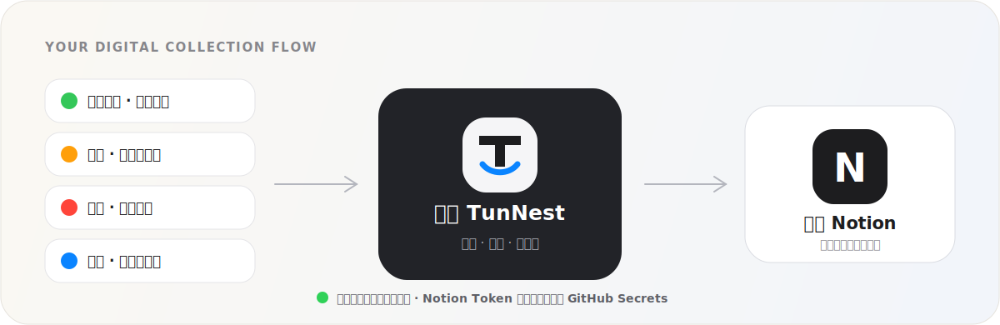
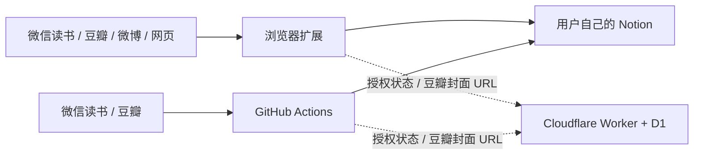

<div align="center">
  
  <h1>囤囤 TunNest</h1>
  <p><strong>把散落的喜欢，收进自己的数字巢穴。</strong></p>
  <p>微信读书、豆瓣、微博与网页剪藏，一站同步到你自己的 Notion。</p>

  <p>
    <a href="https://github.com/zengyincen/TunNest/actions/workflows/ci.yml"></a>
    
    
    
    
    <a href="LICENSE"></a>
  </p>

  <p>
    <a href="#快速开始">快速开始</a> ·
    <a href="#完整部署教程">完整部署</a> ·
    <a href="#notion-完整配置">Notion 配置</a> ·
    <a href="#github-actions-每日同步">每日同步</a> ·
    <a href="#常见问题与排错">排错</a>
  </p>
</div>



> [!IMPORTANT]
> TunNest 仍处于早期版本。微信读书、豆瓣和微博的接口、页面结构及风控规则可能随时变化。请只同步你有权访问和保存的内容，并遵守对应平台条款。

## 囤囤是什么

囤囤不是另一个内容平台，而是一条通往私人资料库的路。它把四种来源整理进七个 Notion 数据库，让读过的书、看过的电影、喜欢的博文、三套豆瓣 Top 250 和网页收藏真正可搜索、可整理、可长期回顾。

| 来源 | 保存内容 | 浏览器扩展 | GitHub Actions |
|---|---|:---:|:---:|
| 微信读书 | 书籍、封面、划线、笔记 | ✅ 浏览器登录或 Gateway | ✅ 需要 Gateway API Key |
| 豆瓣 | 用户书影收藏 + 电影 / 图书 / 音乐 Top 250 | ✅ 自动签名与榜单抓取 | ✅ 自动签名与榜单抓取 |
| 微博 | 用户博文、完整长文、转发内容、原图配图、互动数据 | ✅ 浏览器登录态 | — 不适合无人值守抓取 |
| 任意网页 | 标题、正文、选区、作者、原文链接、封面 | ✅ 一键剪藏 | — 需要用户主动选择页面 |

<table>
  <tr>
    <td align="center"><strong>4</strong><br><sub>类收藏来源</sub></td>
    <td align="center"><strong>7</strong><br><sub>套独立 Notion 数据库</sub></td>
    <td align="center"><strong>7 天</strong><br><sub>新用户完整试用</sub></td>
    <td align="center"><strong>3 台</strong><br><sub>付费浏览器设备</sub></td>
    <td align="center"><strong>1 个</strong><br><sub>Actions 仓库槽位</sub></td>
    <td align="center"><strong>每天 1 次</strong><br><sub>微信读书 / 豆瓣同步</sub></td>
  </tr>
</table>



它适合微信读书和 Notion 重度用户、书影音爱好者、追星与内容收藏用户、文艺青年、网页仓鼠派，以及希望数据最终回到自己手里的人。

## 快速开始

1. 从 [Releases](https://github.com/zengyincen/TunNest/releases) 下载最新扩展 ZIP；如果暂时没有 Release，按下面命令自己打包。
2. 解压 `tunnest-extension.zip`。
3. 打开 Chrome 的 `chrome://extensions`。
4. 开启右上角“开发者模式”，点击“加载已解压的扩展程序”。
5. 选择解压后的 `tunnest-extension` 文件夹。
6. 打开扩展设置，配置 Notion，然后开始 7 天完整试用。

自己打包：

```bash
git clone https://github.com/zengyincen/TunNest.git
cd TunNest
npm ci
npm test
npm run check
npm run package
```

打包结果位于：

```text
dist/tunnest-extension/       # 可直接在 Chrome 加载
dist/tunnest-extension.zip    # 可上传到 GitHub Release
```

> [!TIP]
> 更新源码后，在 `chrome://extensions` 找到囤囤并点击“重新加载”。如果仍看到旧设置页面，请先关闭旧弹窗再重新打开。


## Notion 完整配置

囤囤共用一个 Notion Internal Integration Token，共连接七个数据库：网页、微信读书、微博各一个，豆瓣父页面下四个。四类来源可以位于四个不同父页面。

### 1. 创建 Notion Integration

1. 打开 [Notion Integrations](https://www.notion.so/my-integrations)。
2. 点击创建新的 Internal Integration。
3. 选择目标工作区。
4. 开启读取内容、插入内容和更新内容权限。
5. 复制 `ntn_…` 或 `secret_…` 开头的 Internal Integration Token。

Token 相当于进入数据库的钥匙，不要提交到 GitHub 源码，也不要发到 Issue。

### 2. 创建并授权四个父页面

建议在 Notion 新建四个空白页面：

- 囤囤 · 网页剪藏；
- 囤囤 · 微信读书；
- 囤囤 · 豆瓣（这个页面下放置用户、电影 Top 250、图书 Top 250、音乐 Top 250）；
- 囤囤 · 微博博文。

在每个页面右上角打开“连接 / Connections”菜单，把刚创建的 Integration 加入页面。只有授权给 Integration 的页面才能创建或连接数据库。

### 3. 让扩展自动创建数据库

1. 打开囤囤扩展设置。
2. 在“共用 Integration Token”中粘贴 Token。
3. 在某个来源的“父页面链接”中粘贴对应 Notion 页面链接。
4. 保持“已有数据库 ID”为空。
5. 点击“创建或连接”。
6. 对网页、微信读书和微博分别重复操作；豆瓣卡片需要依次连接四个数据库。

扩展会自动创建数据库和全部必需属性，并把生成的数据库 ID 保存到本机。豆瓣卡片中的四个按钮使用同一个父页面链接，因此四个数据库会并列创建在同一 Notion 页面下。

### 4. 连接已有数据库

如果已经有数据库：

1. 把数据库共享给同一个 Integration；
2. 复制数据库链接或链接中 32 位数据库 ID；
3. 填入对应来源的“已有数据库 ID”；
4. 点击“创建或连接”。

扩展会自动把标题列改成该来源要求的名称，并创建缺失属性。如果同名属性存在但类型错误，为避免破坏数据，扩展会停止并列出冲突；请先在 Notion 中重命名或删除冲突属性，再重新连接。

> [!WARNING]
> 七个数据库里的“外部 ID”必须是普通“文本 / Rich text”属性，不能使用 Notion 的“唯一 ID / Unique ID”属性。它是 TunNest 更新和去重的关键字段。

### 网页剪藏数据库

默认数据库名：`囤囤 · 网页剪藏`

| 属性 | Notion 类型 | 用途 |
|---|---|---|
| 标题 | 标题（Title） | 网页或文章标题 |
| 封面 | 文件与媒体（Files & media） | 网页 OG 图片 |
| 类型 | 选择（Select） | 网页、文章等 |
| 原文 | URL | 原始链接 |
| 作者 | 文本（Rich text） | 页面作者 |
| 摘要 | 文本（Rich text） | 页面描述或选区摘要 |
| 标签 | 多选（Multi-select） | 来源与标签 |
| 收藏时间 | 日期（Date） | 剪藏时间 |
| 外部 ID | 文本（Rich text） | URL 去重键 |

### 微信读书数据库

默认数据库名：`囤囤 · 微信读书`

| 属性 | Notion 类型 | 用途 |
|---|---|---|
| 书名 | 标题（Title） | 书名 |
| 封面 | 文件与媒体（Files & media） | 书籍封面 |
| 作者 | 文本（Rich text） | 作者 |
| 原书链接 | URL | 微信读书详情页 |
| 划线数量 | 数字（Number） | 划线与笔记总数 |
| 同步摘要 | 文本（Rich text） | 本次同步摘要 |
| 标签 | 多选（Multi-select） | 来源和自定义标签 |
| 同步时间 | 日期（Date） | 最近同步时间 |
| 外部 ID | 文本（Rich text） | Book ID 去重键 |

书籍图片会同时写入“封面”属性和 Notion 页面封面。

### 豆瓣用户数据库

默认数据库名：`囤囤 · 豆瓣用户`

| 属性 | Notion 类型 | 用途 |
|---|---|---|
| 名称 | 标题（Title） | 书籍或电影名称 |
| 封面 | 文件与媒体（Files & media） | 书籍封面或影视海报 |
| 封面原图 | URL | 豆瓣原始图片直链 |
| 类型 | 选择（Select） | 书籍、电影 |
| 原条目 | URL | 豆瓣条目链接 |
| 主创 | 文本（Rich text） | 作者或导演 |
| 状态 | 选择（Select） | 想读、在读、读过、想看、在看、看过 |
| 评分 | 数字（Number） | 用户评分 |
| 短评 | 文本（Rich text） | 用户短评或简介 |
| 标签 | 多选（Multi-select） | 用户标签和题材 |
| 收藏时间 | 日期（Date） | 豆瓣标记时间 |
| 外部 ID | 文本（Rich text） | Subject ID 去重键 |

### 豆瓣电影 / 图书 / 音乐 Top 250 数据库

默认数据库名分别为：

- `囤囤 · 豆瓣电影 Top 250`；
- `囤囤 · 豆瓣图书 Top 250`；
- `囤囤 · 豆瓣音乐 Top 250`。

三套榜单使用独立的结构化属性，不再把作者、年份等内容混在一个“信息”字段中。三套数据库共有以下属性：

| 属性 | Notion 类型 | 用途 |
|---|---|---|
| 名称 | 标题（Title） | 电影、图书或音乐名称 |
| 封面 | 文件与媒体（Files & media） | 海报、书封或专辑封面 |
| 封面原图 | URL | 豆瓣原始图片直链 |
| 排名 | 数字（Number） | 榜单原始排名；上游条目下架时可能出现跳号 |
| 评分 | 数字（Number） | 豆瓣当前评分 |
| 评价人数 | 数字（Number） | 当前评价人数 |
| 推荐语 | 文本（Rich text） | 榜单推荐语；音乐条目可能为空 |
| 原条目 | URL | 豆瓣条目链接 |
| 标签 | 多选（Multi-select） | 豆瓣及榜单类型 |
| 抓取时间 | 日期（Date） | 本次榜单更新时间 |
| 外部 ID | 文本（Rich text） | Subject ID 去重键 |

电影 Top 250 专属属性：

| 属性 | Notion 类型 | 用途 |
|---|---|---|
| 导演 | 文本（Rich text） | 导演姓名 |
| 主演 | 文本（Rich text） | 主要演员 |
| 年份 | 文本（Rich text） | 上映年份；保留多地区年份 |
| 国家/地区 | 文本（Rich text） | 制片国家或地区 |
| 类型 | 多选（Multi-select） | 剧情、犯罪、动画等类型 |

图书 Top 250 专属属性：

| 属性 | Notion 类型 | 用途 |
|---|---|---|
| 作者 | 文本（Rich text） | 作者姓名 |
| 译者 | 文本（Rich text） | 译者；无译者时为空 |
| 出版社 | 文本（Rich text） | 出版社 |
| 出版日期 | 文本（Rich text） | 原榜单中的出版年月或日期 |
| 定价 | 文本（Rich text） | 原始定价及币种 |

音乐 Top 250 专属属性：

| 属性 | Notion 类型 | 用途 |
|---|---|---|
| 艺术家 | 文本（Rich text） | 歌手、乐队或原声作者 |
| 发行日期 | 文本（Rich text） | 专辑发行日期 |
| 版本类型 | 选择（Select） | 专辑、单曲、EP、Import 等 |
| 介质 | 选择（Select） | CD、Audio CD、数字介质等 |
| 流派 | 多选（Multi-select） | 流行、摇滚、民谣等流派 |

豆瓣封面不再逐张下载并上传到 Notion。囤囤会把现有 Cloudflare Worker 生成的缓存代理直链写入“封面”，同时把豆瓣原始地址写入“封面原图”。这不使用 D1、R2 或其他对象存储；首次访问由 Worker 转发，后续由边缘缓存直接返回。

### 微博博文数据库

默认数据库名：`囤囤 · 微博博文`

| 属性 | Notion 类型 | 用途 |
|---|---|---|
| 博文 | 标题（Title） | 用户名和正文开头 |
| 封面 | 文件与媒体（Files & media） | 第一张成功上传的配图 |
| 用户 | 文本（Rich text） | 微博用户名 |
| 原博文 | URL | 原博文链接 |
| 正文摘要 | 文本（Rich text） | 博文正文摘要 |
| 转发数 | 数字（Number） | 同步时的转发数 |
| 评论数 | 数字（Number） | 同步时的评论数 |
| 点赞数 | 数字（Number） | 同步时的点赞数 |
| 标签 | 多选（Multi-select） | 来源和标签 |
| 发布时间 | 日期（Date） | 博文发布时间 |
| 外部 ID | 文本（Rich text） | Post ID 去重键 |

微博原图会先由扩展下载，再上传到用户自己的 Notion 文件空间；第一张图片同时写入“封面”属性，全部图片写入页面正文。请在上传过程中保持浏览器运行。

## 来源账号配置

### 网页剪藏

1. 先连接“网页剪藏”数据库。
2. 打开想收藏的页面。
3. 在扩展弹窗点击“剪藏当前网页”。
4. 也可以选中文本后右键，选择“保存到囤囤 TunNest”。
5. 默认快捷键为 `Alt+Shift+S`；macOS 为 `Control+Shift+S`。

强交互网页、付费墙、跨域 iframe 或登录后动态内容可能无法完整提取。

### 微信读书

浏览器同步不需要 API Key：

1. 打开 [微信读书网页版](https://weread.qq.com/)并完成登录；
2. 保持至少一个 `weread.qq.com` 标签页处于打开状态；
3. 扩展设置中的 Gateway API Key 留空；
4. 点击“同步微信读书”。

如果填写 Gateway API Key，扩展会优先使用 Gateway，不再依赖打开的网页。Gateway API Key 不是浏览器 Cookie；请只使用你有权获得的 Key，不要把 Cookie 当作 Key 填入。

GitHub Actions 无法复用浏览器登录，因此自动同步微信读书时 `WEREAD_API_KEY` 是必填项。如果没有 Gateway API Key，仍可正常使用浏览器手动同步，但不要运行 Actions 的微信读书来源。

### 豆瓣

1. 打开自己的豆瓣主页，例如 `https://www.douban.com/people/example/`。
2. 复制 `/people/` 后面的 ID，或直接复制完整主页链接。
3. 粘贴到扩展设置的“豆瓣用户 ID”。
4. 在豆瓣数据库卡片中，用同一个父页面依次创建或连接用户、电影 Top 250、图书 Top 250、音乐 Top 250 四个数据库。
5. 公共收藏无需 API Key，也通常不需要 Auth Token。
6. 点击“同步豆瓣”。扩展会先读取输入用户的书影收藏，再抓取 `movie.douban.com/top250`、`book.douban.com/top250` 和 `music.douban.com/top250` 的全部分页，分别写入四个数据库。

首次同步会创建约 750 个榜单页面，受 Notion API 速率限制通常需要数分钟，请保持浏览器运行。封面通过许可证 Worker 的缓存代理直链写入，不再逐张上传，因此不占用 Notion File Upload 时间。豆瓣偶尔会在某一页隐藏已下架条目，因此实际可见数量可能略少于 250；TunNest 会保留源站排名和其中的跳号，不会自行补造条目。

从 `v1.2.14` 起，TunNest 会自动生成当前 Frodo 接口要求的时间戳与签名。旧版出现 `invalid_request_997` 时，请升级扩展并在 `chrome://extensions` 点击“重新加载”。

豆瓣过去的公开 API 已停止面向新项目申请。当前适配属于实验性兼容层，可能因签名和风控变化失效，不代表豆瓣官方授权。

### 微博

1. 先在 [微博桌面版](https://weibo.com/)登录。
2. 打开要同步的用户主页，确认浏览器中可以正常看到博文。
3. 从主页 URL 找到纯数字 UID，例如 `https://weibo.com/u/6063458646` 中的 `6063458646`。
4. 在扩展设置中填写 UID；多个 UID 用逗号、中文逗号或空格分隔。
5. 设置同步页数，范围为 1–10 页。
6. 保存设置后点击“同步微博”。

扩展优先复用桌面微博登录态，必要时回退到已打开的移动微博页面。它会读取完整长文、转发内容和原图地址，但不会把 Cookie 上传到 TunNest、Cloudflare 或 GitHub Actions。

微博出现 `432`、验证码、“这里还没有内容”或“需要重新登录”时，请先在微博页面完成验证，确认主页能正常显示，再等待一段时间重试。不要连续高频点击同步。

## 许可证与订阅管理

### 订阅规则

新用户首次在线验证后获得连续 7 天完整试用。试用到期只暂停新的同步，不删除或锁定已经写入 Notion 的页面。

所有付费方案功能一致，包含：

- 全部四类同步；
- 3 台浏览器设备；
- 1 个独立 GitHub Actions 仓库槽位；
- 后续维护更新；
- 优先客服支持。

GitHub Actions 属于持续无人值守服务，不提供试用，必须使用有效付费许可证。


### 激活和释放设备

用户在扩展设置中粘贴 `tunnest_…` 许可证并点击“在线激活”。许可证达到浏览器设备上限时，可在旧设备点击“释放本机付费授权”，然后在新设备重新激活。

管理员也可以调用 API。以下命令中的 `lic_xxx` 是签发日志里的许可证记录 ID：

```bash
# 暂停
curl -X PATCH "$LICENSE_API_BASE/v1/admin/licenses/lic_xxx" \
  -H "Authorization: Bearer $LICENSE_ADMIN_TOKEN" \
  -H "Content-Type: application/json" \
  -d '{"status":"suspended"}'

# 恢复
curl -X PATCH "$LICENSE_API_BASE/v1/admin/licenses/lic_xxx" \
  -H "Authorization: Bearer $LICENSE_ADMIN_TOKEN" \
  -H "Content-Type: application/json" \
  -d '{"status":"active"}'

# 延长 30 天
curl -X PATCH "$LICENSE_API_BASE/v1/admin/licenses/lic_xxx" \
  -H "Authorization: Bearer $LICENSE_ADMIN_TOKEN" \
  -H "Content-Type: application/json" \
  -d '{"extendDays":30}'

# 清空所有设备和 Actions 绑定
curl -X PATCH "$LICENSE_API_BASE/v1/admin/licenses/lic_xxx" \
  -H "Authorization: Bearer $LICENSE_ADMIN_TOKEN" \
  -H "Content-Type: application/json" \
  -d '{"clearDevices":true}'

# 永久撤销
curl -X PATCH "$LICENSE_API_BASE/v1/admin/licenses/lic_xxx" \
  -H "Authorization: Bearer $LICENSE_ADMIN_TOKEN" \
  -H "Content-Type: application/json" \
  -d '{"status":"revoked"}'
```

## GitHub Actions 每日同步

每日工作流只同步适合稳定 GET/POST 的微信读书和豆瓣。微博和网页剪藏不会进入无人值守任务。

### 1. 准备数据库 ID

先在扩展中连接微信读书和豆瓣数据库。数据库 ID 可以直接从扩展设置复制，也可以从 Notion 数据库链接中提取 32 位 ID。

### 2. 配置 Variable

在 `Settings → Secrets and variables → Actions → Variables` 添加：

| 名称 | 必填 | 示例 |
|---|:---:|---|
| `LICENSE_API_BASE` | ✅ | `https://license.example.com`，末尾不要加 `/` |

### 3. 配置 Secrets

在 `Settings → Secrets and variables → Actions → Secrets` 添加：

| Secret | 哪个任务需要 | 说明 |
|---|---|---|
| `TUNNEST_LICENSE_KEY` | 两者 | 有效付费许可证，不能使用试用 |
| `NOTION_TOKEN` | 两者 | 共用 Notion Integration Token |
| `NOTION_WEREAD_DATABASE_ID` | 微信读书 | 微信读书数据库 ID |
| `WEREAD_API_KEY` | 微信读书 | 微信读书 Gateway API Key |
| `NOTION_DOUBAN_DATABASE_ID` | 豆瓣 | 用户收藏数据库 ID |
| `NOTION_DOUBAN_MOVIE_TOP250_DATABASE_ID` | 豆瓣 | 电影 Top 250 数据库 ID |
| `NOTION_DOUBAN_BOOK_TOP250_DATABASE_ID` | 豆瓣 | 图书 Top 250 数据库 ID |
| `NOTION_DOUBAN_MUSIC_TOP250_DATABASE_ID` | 豆瓣 | 音乐 Top 250 数据库 ID |
| `DOUBAN_USER_ID` | 豆瓣 | `/people/` 后面的用户 ID |
| `DOUBAN_AUTH_TOKEN` | 豆瓣，可选 | 仅非公开收藏需要 |
| `LICENSE_ADMIN_TOKEN` | 仅发码 | 管理员密钥；每日同步本身不读取 |

`DOUBAN_API_KEY` 从 `v1.2.14` 起不再需要，可以删除。旧版 `NOTION_DATABASE_ID` 只作为兼容回退，不建议新配置继续使用。

### 4. 手动测试工作流

1. 打开仓库 `Actions`。
2. 选择 `TunNest daily content sync`。
3. 点击 `Run workflow`。
4. 选择 `weread`、`douban` 或 `all`。
5. 查看两个独立 Job 的日志。

微信读书失败不会阻止豆瓣，反之亦然。许可证会在读取平台内容和写入 Notion之前验证；验证失败时不会继续抓取或写入。

### 5. 修改每天运行时间

默认配置：

```yaml
schedule:
  - cron: "23 18 * * *"
```

GitHub Cron 使用 UTC。`18:23 UTC` 对应北京时间次日约 `02:23`，实际启动可能延迟几分钟。比如每天北京时间 09:00 可改为：

```yaml
schedule:
  - cron: "0 1 * * *"
```

修改文件：`.github/workflows/daily-sync.yml`，提交到默认分支后生效。

### 6. GitHub Action 付费限制

每张付费许可证包含 1 个 Actions 仓库槽位，以 `owner/repository` 作为绑定标识，不占用 3 个浏览器槽位。同一许可证放入第二个仓库会被拒绝；需要迁移时，由管理员执行 `{"clearDevices":true}`，再在新仓库运行。

## 发布到 GitHub

提交源码：

```bash
git add .
git commit -m "release: TunNest v1.4.0"
git push origin main
```

GitHub Actions 工作流必须位于 `.github/workflows/*.yml` 并提交到默认分支。只上传 ZIP 不会让源码工作流自动出现。

创建扩展包：

```bash
npm ci
npm test
npm run check
npm run package
```

使用 GitHub CLI 创建 Release：

```bash
gh release create v1.4.0 dist/tunnest-extension.zip \
  --title "TunNest v1.4.0" \
  --notes "囤囤 TunNest v1.4.0"
```

推荐同时保留完整源码仓库和 Release ZIP：源码便于审计、Issue 与 Actions，Release 便于普通用户安装。Cloudflare Secret、GitHub Secret 和 Notion Token 都不会被打进 ZIP，仍需要按本文单独配置。

## 常见问题与排错

<details>
<summary><strong>打开许可证域名显示“接口不存在”</strong></summary>

根路径没有页面，这是正常行为。访问 `https://你的域名/v1/health`；返回 `{"ok":true,...}` 才表示 Worker 正常。
</details>

<details>
<summary><strong>Actions 报错“缺少 LICENSE_ADMIN_TOKEN”</strong></summary>

进入仓库 `Settings → Secrets and variables → Actions → Secrets`，创建名称完全一致的 `LICENSE_ADMIN_TOKEN`。不要创建成 Variable，不要在值外加引号，也不要把 `[https://…](https://…)` 这种 Markdown 链接粘进去。
</details>

<details>
<summary><strong>Actions 报错“管理员认证失败”</strong></summary>

GitHub Secret 与 Cloudflare Worker 中的 `ADMIN_TOKEN` 不一致。重新运行 `npx wrangler secret put ADMIN_TOKEN`，然后把同一个值重新保存到 GitHub `LICENSE_ADMIN_TOKEN`。确认 `LICENSE_API_BASE` 指向刚更新的 Worker。
</details>

<details>
<summary><strong>扩展提示 Manifest is not valid JSON</strong></summary>

通常是编辑 `manifest.json` 时漏了逗号或多了尾逗号。回到项目根目录运行 `npm run check`，按提示修复后重新执行 `npm run package`，不要直接修改 ZIP 内文件。
</details>

<details>
<summary><strong>Notion 提示找不到“外部 ID”</strong></summary>

打开扩展设置，对对应数据库重新点击“创建或连接”。最新版会自动创建缺失属性。如果已经有同名但类型错误的属性，请先重命名或删除它；正确类型是“文本 / Rich text”，不是“唯一 ID”。
</details>

<details>
<summary><strong>Notion 返回 body failed validation</strong></summary>

优先检查数据库是否连接到了正确来源，以及同名属性类型是否与本文属性表一致。重新执行“创建或连接”让扩展补齐 schema；仍失败时保留完整错误文本，并确认 Integration 拥有读取、插入和更新内容权限。
</details>

<details>
<summary><strong>豆瓣出现 invalid_request_997</strong></summary>

升级到 `v1.2.14` 或更高版本，在 `chrome://extensions` 点击“重新加载”。新版自动签名，不要再填写或配置 `DOUBAN_API_KEY`。
</details>

<details>
<summary><strong>微博返回 432、异常、空内容或需要重新登录</strong></summary>

在 `weibo.com` 打开目标用户主页，完成登录或验证码并确认页面能看到博文。等待一段时间后重试，避免短时间内连续同步。微博风控状态无法通过 GitHub Actions 或 Cloudflare 绕过。
</details>

<details>
<summary><strong>微博图片只有链接或上传失败</strong></summary>

升级并重新加载扩展，保持浏览器运行直至配图下载、上传和插入完成。确认 Notion Integration 有更新内容权限。单图超过 Notion 文件限制、微博源图失效或网络中断时，扩展会保留可点击原图链接，避免内容完全丢失。
</details>

<details>
<summary><strong>点击同步后没有反应，或者关闭弹窗后看不到进度</strong></summary>

升级并重新加载扩展。同步进度保存在扩展本地存储，重新打开弹窗会恢复显示；长任务期间不要关闭整个浏览器。若上次同步异常中断，等待状态恢复后重新运行或点击停止。
</details>

<details>
<summary><strong>仓库里看不到 Workflow</strong></summary>

确认 `.github/workflows/ci.yml`、`daily-sync.yml` 和 `issue-license.yml` 已提交到默认分支，并在仓库 `Settings → Actions → General` 允许 Actions。只把扩展 ZIP 上传到 Release 不会添加源码工作流。
</details>

<details>
<summary><strong>Cloudflare 免费额度够用吗</strong></summary>

对早期个人项目通常足够。Worker 处理轻量授权请求和豆瓣封面代理，封面响应会在 Cloudflare 边缘缓存 30 天；D1 仍只保存小型授权记录，不保存图片。实际额度以 Cloudflare 当前免费套餐为准，用户量增长后应查看 Workers 请求量、缓存命中率和 D1 用量面板。
</details>

## 隐私与安全边界



- 收藏内容由扩展或 Actions 直接写入用户自己的 Notion；
- Cloudflare Worker 不接收收藏正文、平台 Cookie 或 Notion Token；它只代理公开的豆瓣封面 URL；
- Notion Token 只保存在本机 `chrome.storage.local` 或 GitHub Secrets；
- D1 只保存许可证哈希、匿名安装码哈希、套餐、到期状态和设备槽位；
- 豆瓣图片使用流式代理和 30 天边缘缓存，不写入 D1、R2 或其他持久存储；
- 扩展不内置许可证公钥，不在本地离线判定永久授权；
- 授权每 6 小时在线刷新一次，临时断网最多宽限 24 小时；
- 微博 Cookie 只由微博页面自身使用，不导出到 TunNest；
- 项目字体为 Noto Sans SC，依据 SIL Open Font License 使用，许可见 `brand/fonts/`。

更详细的边界见 [架构说明](docs/architecture.md) 和 [安全策略](SECURITY.md)。

## 项目结构与开发命令

```text
TunNest/
├── extension/          # Chrome Manifest V3 扩展
├── automation/         # 微信读书、豆瓣 → Notion 同步脚本
├── license-worker/     # Cloudflare Worker + D1 动态授权
├── .github/workflows/  # CI、每日同步和许可证签发
├── brand/              # 图标、Banner、流程图和字体许可
├── docs/               # 架构、策略与验证补充文档
├── test/               # 配置、转换、Notion 与订阅测试
└── tools/              # 管理员许可证工具
```

```bash
npm test          # 运行测试
npm run check     # 检查 JSON、YAML、JS 和扩展资源
npm run package   # 生成扩展目录和 ZIP
npm run sync      # 使用环境变量在本地运行自动同步

cd license-worker
npm run check     # 检查 Worker TypeScript
npm run db:remote # 应用远程 D1 migrations
npm run deploy    # 部署 Worker
```

## 当前能力边界

- 豆瓣用户收藏使用非公开 Frodo 兼容接口，三套 Top 250 读取公开网页；签名、页面结构和风控均可能变化；
- 微博只支持浏览器主动同步，不提供 Actions 自动抓取；
- 网页剪藏效果取决于页面结构、登录态和付费墙；
- 微信读书 Actions 必须有 Gateway API Key，浏览器登录不能直接替代；
- 当前扩展尚未完成 Chrome Web Store 正式审核；
- 发布者需要自行接入支付完成后的自动发码，当前提供人工 Actions 发码流程；
- 保存到 Notion 不改变源内容版权，使用者仍需遵守平台规则和原作者授权范围。

## 灵感与生态参考

研究阶段参考了以下开源项目的产品边界与同步思路：

- [malinkang/weread2notion](https://github.com/malinkang/weread2notion)
- [malinkang/weread2notion-pro](https://github.com/malinkang/weread2notion-pro)
- [malinkang/douban2notion](https://github.com/malinkang/douban2notion)
- [malinkang/duolingo2notion](https://github.com/malinkang/duolingo2notion)
- [malinkang/keep2notion](https://github.com/malinkang/keep2notion)
- [malinkang/notionhub-integration](https://github.com/malinkang/notionhub-integration)

参考不代表从属、合作或官方授权。请尊重各项目的许可证和署名要求。

## 贡献与许可

欢迎提交 Bug、接口兼容修复、文档改进和可复现测试。开始前请阅读 [CONTRIBUTING.md](CONTRIBUTING.md)。涉及上游平台时，不要在 Issue 中公开 Cookie、Token、许可证或其他私密凭据。

项目代码采用 [MIT License](LICENSE)。平台内容、第三方接口、品牌名称和用户保存的数据不因本项目许可证而改变其权利归属。

---

<div align="center">
  
  <p><strong>收藏不是囤积，是给喜欢的东西一个以后还能找到的位置。</strong></p>
  <p><a href="https://github.com/zengyincen/TunNest/releases">下载最新版本</a> · <a href="#快速开始">开始搭建数字巢穴</a></p>
</div>
