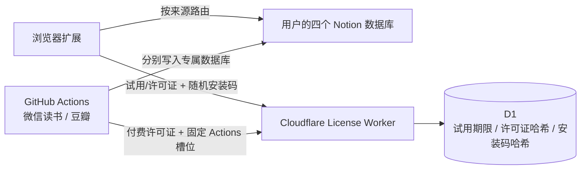

# 囤囤（TunNest）架构与数据边界

- Notion Token 只保存在浏览器 `chrome.storage.local` 或 GitHub encrypted secrets。
- 网页剪藏、微信读书、豆瓣和微博分别保存独立数据库 ID；四个数据库可以位于不同 Notion 父页面，共用一个 Integration Token。
- 微信读书网页 Cookie 和微博 Cookie 不离开浏览器。
- Worker 只处理订阅授权，不接收正文、Cookie、Notion Token 或用户资料库内容。
- Chrome 不提供适合此用途的硬件唯一编码。扩展首次运行时生成 128 位随机安装码，只把 SHA-256 哈希交给 Worker；这比读取硬件指纹更稳定，也更符合商店隐私要求。
- 新安装自动生成另一个不含账号信息的随机试用标识，并优先保存在 `chrome.storage.sync`；同一 Chrome 资料账号重装或换设备仍共享一个 7 天完整试用期。试用到期后扩展停止新的 Notion 写入并展示付费墙，既有 Notion 内容不受影响。
- 许可证原文不写 D1，只写 SHA-256 哈希。所有付费套餐包含 3 个浏览器安装槽位，GitHub Actions 另有 1 个独立槽位，不挤占浏览器额度。
- GitHub Actions 只执行适合稳定 GET/POST 的微信读书 Gateway 和豆瓣 Frodo 同步。
- GitHub Actions 不提供试用：许可证在线验证失败时，脚本在读取平台数据和调用 Notion 之前退出。
- 每个 Notion 页面使用无标题、始终展开的托管内容块保存同步正文；网页剪藏、微信读书、豆瓣和微博都不会显示“TunNest 自动同步区域”，用户在托管块之外手写的内容会保留。

浏览器扩展属于客户端软件，任何纯客户端限制最终都可能被修改。动态 Worker 验证能阻止普通复制许可证、撤销授权和控制设备数量，但不能等同于不可破解的 DRM。
